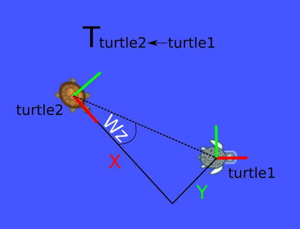

Welcome to the 7th assignment of the "Robot Programming with Lisp" course! (7 Points)

This assignment is for practicing with the Actionlib and TF libraries.
The task is to have one turtle autonomously drawing shapes in turtlesim and
the other one autonomously following it.

Some general notes:
* Write your solutions in the lisp files under 07_turtle_chase, then compile and test them in the JupyterNotebooks.
* Use `byobu` for multi window sessions
* Compile your workspace with `catkin_make`
* Source your workspace with `source devel/setup.bash`. Add the full path to the `/root/.bashrc` file.
* Start the jupyter notebook server with `jupyter-lab --allow-root --no-browser --port 8888 --ip=0.0.0.0`

---------------------
Step 1: launch file
---------------------
(1 Point)

You will need to have a bunch of ROS nodes running for this task.
The best way to manage these nodes is to write a launch file for them.
In the `turtle_chase` directory, deep in the `ros_ws`, there is a `launch` subdirectory.
In there you can find a launch file that starts the turtlesim simulator. Extend it with the following nodes:
 * the keyboard teleoperation node (you might need it for debugging)
 * two TF transforms broadcasters, for "turtle1" and "turtle2"
    * the ROS package is "turtle_tf", the node is called "turtle_tf_broadcaster" and it accepts a parameter "turtle" which is the turtle name.
 * the "shape_server" node of the "turtle_actionlib" ROS package.
    * the name of this server should be something to remember, like 'shape' or 'shape_server', because you need to reference it when turtle1 will move in shapes.


Look in the "turtle_tf_demo.launch" file of the "turtle_tf" ROS package
for an example of such a launch file:
```
$ roscd turtle_tf/launch
```

`roslaunch` the resulting file and make sure it spawns everything without errors.


--------------------------
Step 2: ActionLib client
--------------------------
(2 Points)

In the `turtle_chase` directory there is an ASDF system definition for
this assignment. It already has all the necessary dependencies listed for you.
(You can, of course, add new dependencies if needed.)
The components of the system are 3 files:
"package.lisp" with the Lisp namespace definition, it is already there for you,
"turtlesim-action-client.lisp" which will contain the ActionLib client code and
"turtlesim-tf" which will implement the follower behaviour for the turtles.

In the file "turtlesim-action-client.lisp" write a function
CALL-SHAPE-ACTION-IN-A-LOOP that accepts no arguments and calls the "turtle_actionlib"
"ShapeAction" in an endless loop with different number of edges and with radius = 2.
Choose the number of edges randomly between 2 and 5. 

The shape_server name in the launchfile must be the same as the action-name in the Lisp action-client.

You may reuse the code from the ActionLib client tutorial:
ActionLib client: http://wiki.ros.org/actionlib_lisp/Tutorials/actionlibBasicUsage

TIPS:
- Don't forget to start a ROS node every time you want to communicate with other
  nodes from Lisp (ROSLISP:START-ROS-NODE).
- If your action client is dead try reinitializing it (INIT-ACTION-CLIENT from
  the tutorial).
- If you get weird ActionLib errors at runtime, try restarting your ROS node
  (ROSLISP:START-ROS-NODE) or the action server (restarting the launch file).

See also the `turtle1-shape-action.ipynb` file to test your `call-shape-action-in-a-loop` function.
Calling this function will block the kernel endlessly, as long as the turtle moves.

------------------------------------
Step 3: TF and navigation commands
------------------------------------
(4 Points)

While turtle1 is moving you can read its TF data and calculate how to move turtle2, to make it follow. We would like to subscribe to the TF topic, read the coordinates of turtles and send some navigation commands to one of the turtles. The `call-shape-action-in-a-loop` is busy looping the action goals, so fire up the other notebook `turtle2-follower.ipynb` for a fresh kernel.

Spawn a new turtle called "turtle2" in the turtlesim: you may use the command
line or the SPAWN-TURTLE function from the previous assignment:

```
$ rosservice call /spawn TAB ENTER
```
where TAB stands for the TAB key and ENTER for the ENTER key. It will spawn turtle2 into the turtlesim.


To check if the TF publishing is working use
```
$ rostopic echo /tf
```
or better
```
$ rosrun tf tf_echo turtle1 turtle2
```
CTRL-C kills the echo.

In the file "turtlesim-tf.lisp" write a function FOLLOW-TURTLE-IN-A-LOOP
which accepts 2 arguments: FOLLOWER-NAME and FOLLOWEE-NAME, which are turtle names,
e.g. the strings "turtle1" and "turtle2".
This function

 * initializes a new CL-TF:TRANSFORM-LISTENER and a new publisher
    for turtle command velocities (see the SET-TURTLE-VELOCITY function from
    assignment_6) that will send commands to the turtle called FOLLOWER-NAME.
 * in an endless loop with 100 Hz frequency (every 0.01 seconds) it looks
    up the coordinates of FOLLOWEE-NAME relative to FOLLOWER-NAME and gives
    FOLLOWER-NAME a navigation command.

You may reuse the code from the CL-TF tutorial here: http://wiki.ros.org/cl_tf/Tutorials/clTfBasicUsage

The navigation command consists of
- a linear velocity V, in 2D we are only interested in Vx - the X component,

- and angular velocity W, we are only interested in the angle around the Z axis - Wz.

  Vx defines how fast our turtle moves, 

  Wz defines the direction, i.e. the turning angle.

  Wz = 0 means the turtle moves straight,

  Wz = PI means it turns 180 degrees to the left (right hand rule),

  Wz = - PI/2 means it turns 90 degree right, and so on.



In the illustration above Wz is the angle between the X axis and the coordinates of turtle1.

For the linear velocity you can choose a constant value, e.g. 1.0.

TIPS:
- Each time the communication between your TF listener and the publishers
  (that you start through the launch file) breaks, your TF listener freezes.
  Make sure you restart the ROS node each time the launch file / ROS master dies
  (ROSLISP:START-ROS-NODE).
- You can see the commands your Lisp program is sending to the turtle by listening
  to the corresponding topic (`$ rostopic echo /turtle2/cmd_vel`)
  
  
